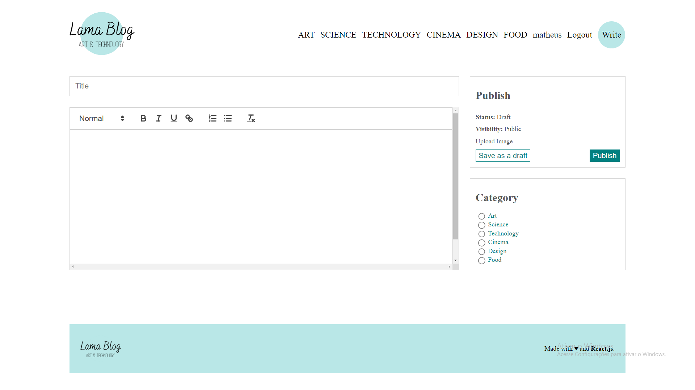

<h1 align="center" > Tech-Blog </h1>
<br>
<p align="center">
    




</p>

#  📝 Descrição do projeto
<p>
 Blog full stack que combina React.js no frontend e Node.js com MySQL no backend. Na parte de autenticação do usuario, integrei a funcionalidade utilizando JSON Web Tokens (JWT), com os tokens JWT armazenados em cookies para uma gestão eficiente das sessões dos usuários. Além disso, a aplicação capacita os usuários a criarem e editarem posts no blog, com as postagens sendo salvas diretamente no banco de dados, garantindo uma persistência eficaz das informações.
</p>

## Pré-requisitos

Antes de instalar o NPM, certifique-se de que o Node.js esteja instalado em seu sistema. O NPM é distribuído junto com o Node.js, portanto, ao instalar o Node.js, você automaticamente obtém o NPM.

Você pode baixar o Node.js no [site oficial do Node.js](https://nodejs.org). Siga as instruções de instalação apropriadas para o seu sistema operacional.

## Verificando a Instalação do NPM

Após instalar o Node.js, você pode verificar se o NPM está instalado corretamente digitando o seguinte comando no seu terminal ou prompt de comando:

```bash
npm -v
```

Isso exibirá a versão atual do NPM instalada em seu sistema. Se o comando retornar a versão do NPM, significa que a instalação foi bem-sucedida e você está pronto para começar a usar o NPM.

## Atualizando o NPM

É uma boa prática manter o NPM atualizado para aproveitar as últimas correções de bugs e recursos. Para atualizar o NPM para a versão mais recente, você pode usar o seguinte comando:

```bash
npm install -g npm@latest
```

Este comando instalará a versão mais recente do NPM globalmente em seu sistema.

## 🚀 Tecnologias e bibliotecas

Esse projeto está sendo desenvolvido com as seguintes tecnologias:

Front-end
- React.JS
- Axios
- Moment
- React-Quill
- Sass
- React-router-dom

Back-end
- NodeJS
- Express
- Nodemon
- Bcrypt
- Cookie-parser
- Json Web Token
- Multer

Banco de dados: <br><br>
-MySQL
